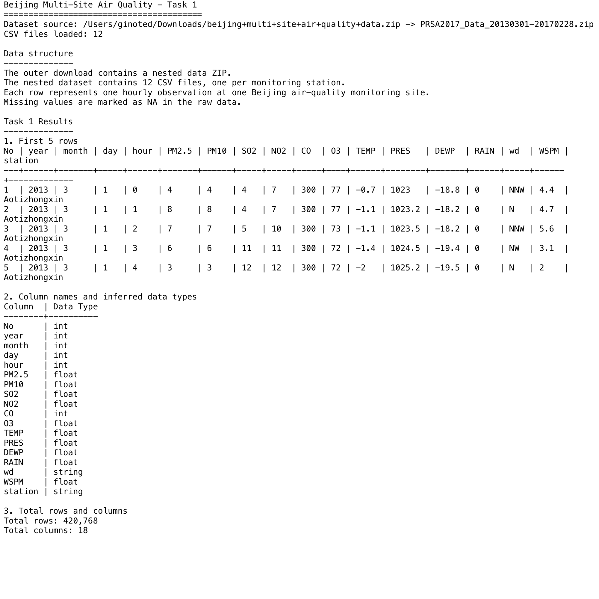

# Beijing Multi-Site Air Quality - Task 1

This project completes **Task 1** for the UCI **Beijing Multi-Site Air Quality** dataset.

Dataset link: [UCI Machine Learning Repository - Beijing Multi-Site Air Quality](https://archive.ics.uci.edu/dataset/501/beijing+multi+site+air+quality+data)

## Data Structure

The downloaded package contains:

- An outer ZIP file: `beijing+multi+site+air+quality+data.zip`
- A nested ZIP file: `PRSA2017_Data_20130301-20170228.zip`
- Inside the nested ZIP there are **12 CSV files**, one for each air-quality monitoring station in Beijing

Each record represents **one hourly observation** at one monitoring station.

The dataset includes **18 columns**:

`No`, `year`, `month`, `day`, `hour`, `PM2.5`, `PM10`, `SO2`, `NO2`, `CO`, `O3`, `TEMP`, `PRES`, `DEWP`, `RAIN`, `wd`, `WSPM`, `station`

Missing values are stored as `NA` in the raw dataset.

## Task 1 Requirements Completed

- Load the dataset
- Display the first 5 rows
- Identify column names and data types
- Count total rows and columns

## Result Summary

- Total CSV files loaded: `12`
- Total rows: `420,768`
- Total columns: `18`

### Inferred Column Data Types

| Column | Data Type |
| --- | --- |
| No | int |
| year | int |
| month | int |
| day | int |
| hour | int |
| PM2.5 | float |
| PM10 | float |
| SO2 | float |
| NO2 | float |
| CO | int |
| O3 | float |
| TEMP | float |
| PRES | float |
| DEWP | float |
| RAIN | float |
| wd | string |
| WSPM | float |
| station | string |

## Screenshot of Outcome



## How to Run

Run the script with the downloaded ZIP file:

```bash
python3 analyze_task1.py \
  --dataset "/Users/ginoted/Downloads/beijing+multi+site+air+quality+data.zip" \
  --save-output output/task1_output.txt \
  --save-html output/task1_result.html
```

## Files in This Project

- `analyze_task1.py`: main script for Task 1
- `output/task1_output.txt`: plain-text outcome
- `output/task1_output.txt.png`: screenshot of the outcome
- `output/task1_result.html`: HTML report used to create the screenshot
- `output/task1_result.png`: browser-rendered report image

## GitHub Link

GitHub folder URL:

`https://github.com/Ted323-NZ/YoobeeMSE800/tree/codex/mse803-week02-w2-a1/MSE803DataAnalytics/Week02/W2-A1`
