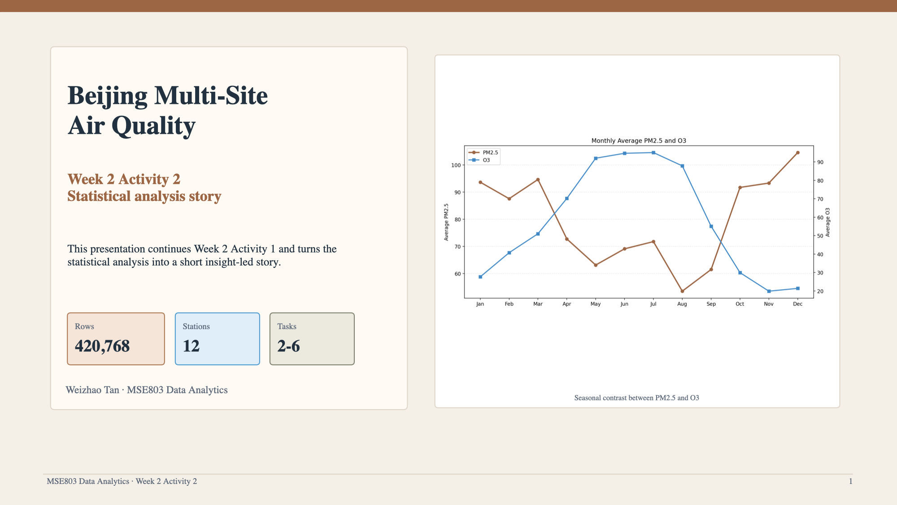

# Week 2 Activity 2 - Beijing Multi-Site Air Quality

This folder contains the deliverables for **Week 2 - Activity 2** using the **Beijing Multi-Site Air Quality** dataset.

Dataset source: [UCI Machine Learning Repository - Beijing Multi-Site Air Quality](https://archive.ics.uci.edu/dataset/501/beijing+multi+site+air+quality+data)

## Scope Used

The Blackboard wording for **Tasks 2 to 6** was not available locally when this activity was prepared, so the work was completed using a standard statistical analysis sequence:

- Task 2: missing-value and data quality review
- Task 3: descriptive statistics
- Task 4: monthly and hourly trend analysis
- Task 5: correlation analysis
- Task 6: station comparison and final insight summary

If your Blackboard task wording is more specific, this folder can be adjusted quickly to match it.

## Data Source Confirmed

The downloaded dataset was used directly from:

`/Users/ginoted/Downloads/beijing+multi+site+air+quality+data.zip`

The script reads the nested dataset archive:

- `PRSA2017_Data_20130301-20170228.zip`
- 12 station CSV files
- 420,768 total rows
- 18 columns

## Main Results

- Highest missing-rate column: `CO` (`4.92%`)
- Highest average PM2.5 station: `Dongsi` (`86.19`)
- Lowest average PM2.5 station: `Dingling` (`65.99`)
- Peak PM2.5 month: `Dec` (`104.58`)
- Peak O3 month: `Jul` (`95.09`)
- Peak PM2.5 hour: `22:00`
- Peak O3 hour: `16:00`
- Strongest positive PM2.5 correlation: `PM10` (`0.88`)
- Strongest negative PM2.5 correlation: `WSPM` (`-0.27`)

## Deliverables in This Folder

- `scripts/analyze_tasks2_to_6.py`: analysis code for Tasks 2-6
- `output/analysis_summary.md`: short written analysis summary
- `output/*.csv`: result tables
- `figures/*.png`: generated charts for the analysis
- `slides/build_presentation.js`: PowerPoint generation script
- `output/beijing_air_quality_insights_week2_activity2.pptx`: PowerPoint presentation
- `output/beijing_air_quality_insights_week2_activity2.pptx.png`: preview image of the PowerPoint deck
- `presentation_script.md`: 3-minute speaking script for the recorded video
- `recording_guide.md`: quick steps for producing the final 3-minute video

## Presentation Preview



## How to Run

### 1. Generate analysis outputs

```bash
python3 scripts/analyze_tasks2_to_6.py \
  --dataset "/Users/ginoted/Downloads/beijing+multi+site+air+quality+data.zip"
```

### 2. Build the PowerPoint deck

```bash
node slides/build_presentation.js
```

If `pptxgenjs` is not installed locally, the script falls back to an existing local package path on this machine. For a clean environment, run:

```bash
npm install
node slides/build_presentation.js
```

## GitHub Link

GitHub folder URL:

`https://github.com/Ted323-NZ/YoobeeMSE800/tree/codex/mse803-week02-w2-a2/MSE803DataAnalytics/Week02/W2-A2`

## Video Note

This folder includes the **PowerPoint** and a **3-minute script** for the required video.  
If needed, the video can be recorded by presenting the slide deck while reading from `presentation_script.md`.
