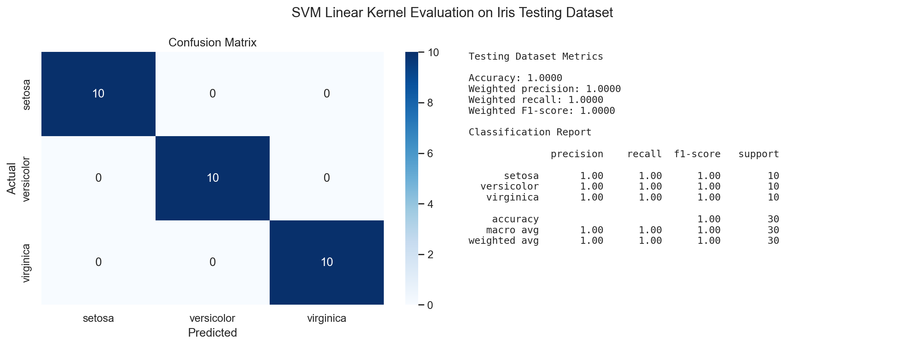
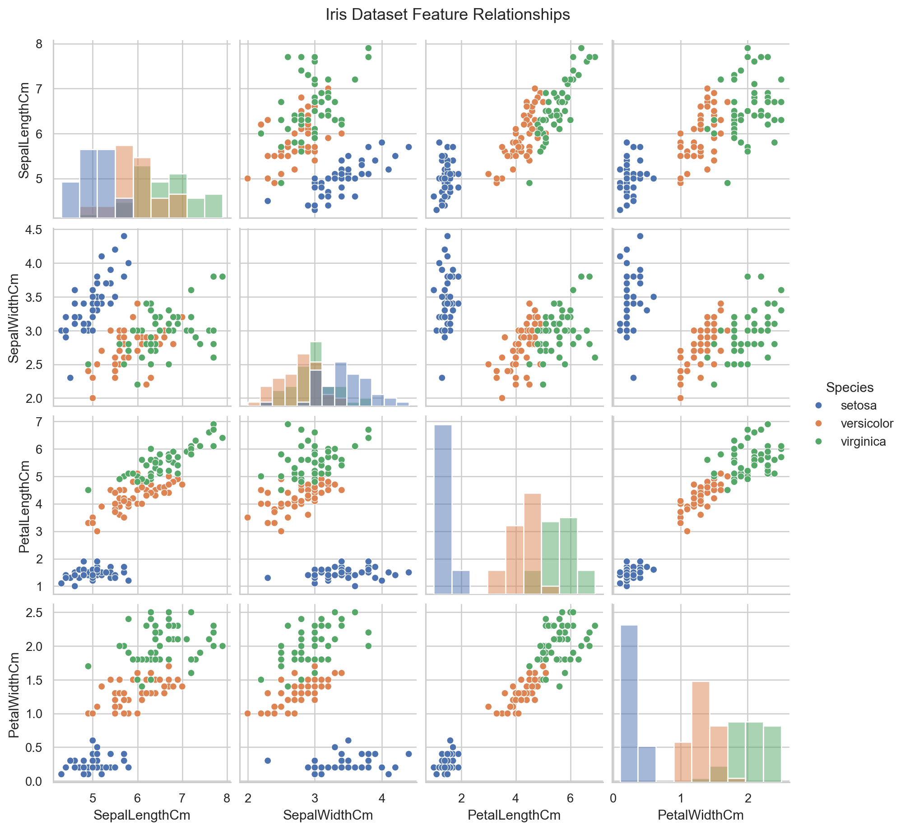

# Week 6 Activity 1: SVM Classification - Iris Dataset

This activity loads, cleans, visualises, trains, and tests a Support Vector Machine classifier on the Iris dataset. The model uses a linear kernel to classify iris flowers into setosa, versicolor, and virginica.

## Files

- `data/Iris.csv`: Iris dataset used for the activity
- `scripts/iris_svm_classification.py`: Python script for cleaning, visualisation, model training, and testing
- `output/iris_pairplot.png`: Dataset visualisation
- `output/evaluation_results.txt`: Testing dataset evaluation output
- `output/svm_results.png`: Screenshot-style summary of model results

## How to Run

```bash
python3 -m venv .venv
source .venv/bin/activate
pip install -r Week06/W6-A1/requirements.txt
python Week06/W6-A1/scripts/iris_svm_classification.py
```

## Process

1. Loaded the Iris CSV dataset.
2. Cleaned the dataset by removing the `Id` column, checking missing values, removing duplicate rows, and simplifying species names.
3. Visualised feature relationships using a pair plot.
4. Split the cleaned data into training and testing datasets.
5. Trained an SVM classifier using a linear kernel.
6. Evaluated the model on the testing dataset using accuracy, precision, recall, F1-score, classification report, and confusion matrix.

## Testing Dataset Results

The SVM model with a linear kernel achieved the following testing dataset results:

- Accuracy: 1.0000
- Weighted precision: 1.0000
- Weighted recall: 1.0000
- Weighted F1-score: 1.0000

The confusion matrix shows that all 30 testing records were classified correctly:

```text
[[10  0  0]
 [ 0 10  0]
 [ 0  0 10]]
```

## Screenshot of Results



## Dataset Visualisation


